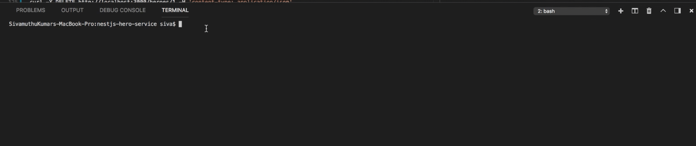

# NestJS Hero Service

NestJS Hero Service is a Hero Service CRUD API with [NestJS](https://nestjs.com) - A progressive Node.js framework for building efficient and scalable server-side applications on top of TypeScript & JavaScript (ES6 / ES7 / ES8)

The REST API is doing CRUD operations on Hero Entity using [Type ORM](http://typeorm.io/#/) with [Mongo](https://www.mongodb.com). You can connect to local mongodb instance or using [Azure Cosmos DB](https://azure.microsoft.com/en-us/services/cosmos-db/).

## Prerequisites

1. NodeJS (v8+)
2. NestJS CLI
3. MongoDB

## Getting started

```bash
$ cd nestjs-hero-service
$ npm install

# development
$ npm run start

# production mode
npm run start:prod
```

## Configure ORMConfig

Edit [ormconfig.js](./ormconfig.js) in root directory to match the host settings of your local / cloud mongodb instance.

## Code Structure

[Hero Module](./heroes/hero.module.ts)

```js
@Module({
  imports: [TypeOrmModule.forFeature([Hero])],
  controllers: [HeroController],
  providers: [HeroService],
})
export class HeroModule {}
```

[Hero Controller](./heroes/hero.controller.ts)

```js
@Controller('heroes')
export class HeroController {
    constructor(private readonly heroservice: HeroService) {}

    @Post()
    async create(@Body() hero: Hero) {
        await this.heroservice.create(hero);
    }

    @Get()
    async findAll(): Promise<Hero[]> {
        return await this.heroservice.findAll();
    }

    @Get(':id')
    async find(@Param('id', new ParseIntPipe()) id: number): Promise<Hero> {
        return await this.heroservice.findById(id);
    }
    ...

}
```

[Hero Service](./heroes/hero.service.ts)

```js
@Injectable()
export class HeroService {
    constructor(
        @InjectRepository(Hero)
        private readonly heroRepo: Repository<Hero>,
      ) {}

    async create(hero: Hero) {
      await this.heroRepo.save(hero);
    }

    ...
}

```

[Hero Model](./heroes/hero.model.ts)

```js
@Entity()
export class Hero {
    @ObjectIdColumn() readonly _id: ObjectID;

    @Column() @Index({ unique: true }) readonly id: number;
    @Column() readonly name: string;
    @Column() readonly saying: string;
}
```

## Demo

### Create a hero
```bash
curl -X POST http://localhost:3000/heroes -H 'content-type: application/json' -d '{ "id": 1,"name": "John Papa","saying": "VSCode can do that.." }'
```

### Get all heroes
```bash
curl -X GET http://localhost:3000/heroes -H 'content-type: application/json' | jq
```
***Output***
```json
[
  {
    "_id": "5b00ea411e8fcdb783d9bd95",
    "id": 1,
    "name": "John Papa",
    "saying": "VSCode can do that.."
  }
]
```

### Get a hero
```bash
curl -X GET http://localhost:3000/heroes/1 -H 'content-type: application/json' | jq
```
***Output***
```json
{
    "_id": "5b00ea411e8fcdb783d9bd95",
    "id": 1,
    "name": "John Papa",
    "saying": "VSCode can do that.."
}
```


### Update a hero
```bash
curl -X PUT http://localhost:3000/heroes/1 -H 'content-type: application/json' -d '{ "name": "John Papa","saying": "VSCode (@code) can do that..." }'
```

### Delete a hero
```bash
curl -X DELETE http://localhost:3000/heroes/1 -H 'content-type: application/json'
```

## Screencapture



